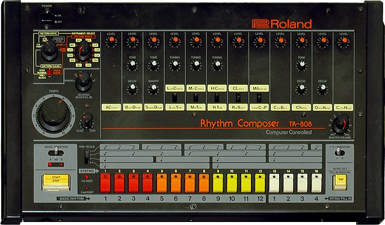

# tr808-pi



*The original Roland TR-808, borrowed from [Wikipedia](https://en.wikipedia.org/wiki/Roland_TR-808#/media/File:Roland_TR-808_(large).jpg)*

This project is a demonstration of emulating the Roland TR-808 drum machine in Sonic Pi. I was  inspired by GUI-based versions such as [tr808r](https://coolbutuseless.github.io/package/tr808r/) and [Roland's online version of TR-808](https://roland50.studio) and decided to make a lightweight text-based version. The samples were taken from [this free resource by Michael Fischer](http://machines.hyperreal.org/manufacturers/Roland/TR-808/).

## How do I get it?

All you need to do is download this git repo as a zip, unarchive it somewhere on your computer.

In Sonic Pi, you then `require` the filepath for the main file `tr808-pi.rb` at the top of your file:

```rb
require "~/Documents/projects/tr808-pi/tr808-pi.rb"
```

## How do I use it?

To play the TR-808, you pass a string format to `tr808()` that represents the beat grid, where:

- the left-hand side is the specific instrument (e.g. `BD` for bass drum)
- followed by a space
- and 16 `x` (play the note) or `-` (do not play the note)

```
BD x---------x----x
SD ----x-------x---
LT ----x-----------
MT --x-------------
HT ------xx--x--x--
LC ----------------
MC -x--------------
HC ----------------
RS ---x--xxx-------
CL ----------------
CP x--------------x
MA --x--x----------
CB ----------------
CY ---x---x--------
OH ----------------
CH ---x-----x-x----
```

You do not have to worry about new lines before or after the `"` but the rest of the format is strict with no error handling to save you for now :D

Here's an example of playing a TR-808 beat grid at 120bpm by passing it to `tr808()`:

```rb
tr808("
BD x---------x----x
SD ----x-------x---
LT ----x-----------
MT --x-------------
HT ------xx--x--x--
LC ----------------
MC -x--------------
HC ----------------
RS ---x--xxx-------
CL ----------------
CP x--------------x
MA --x--x----------
CB ----------------
CY ---x---x--------
OH ----------------
CH ---x-----x-x----
", bpm: 120)
```

In the above example, we have a live beat grid with various instruments playing in a measure
which is 16 notes in total. This will keep playing indefinitely because it is a `live_loop` under the hood. Tweak the `x`'s and `-`'s to explore all the fun possibilities!

You can refer to some popular TR-808 beats [here](http://808.pixll.de/index.php).

## Share your beats!

This string is also copy-paste-able text so that you can easily share it with others! The character length is a bit too long for tweets if you choose to use all the instruments. However, if you only plan to use some of them, you remove some out, for example transforming above example to which fits in a tweet:

```
BD x---------x----x
SD ----x-------x---
LT ----x-----------
MT --x-------------
HT ------xx--x--x--
MC -x--------------
RS ---x--xxx-------
CP x--------------x
MA --x--x----------
CY ---x---x--------
CH ---x-----x-x----
```

If it's too long, you can [create a gist](https://gist.github.com) and share the link. 

Happy beat making y'all!

> **NOTE:** there is no error handling at all so the string format is strict for now. If time permits, I will add enhancements to protect the user, and allow further tweaks to the way the notes are played.